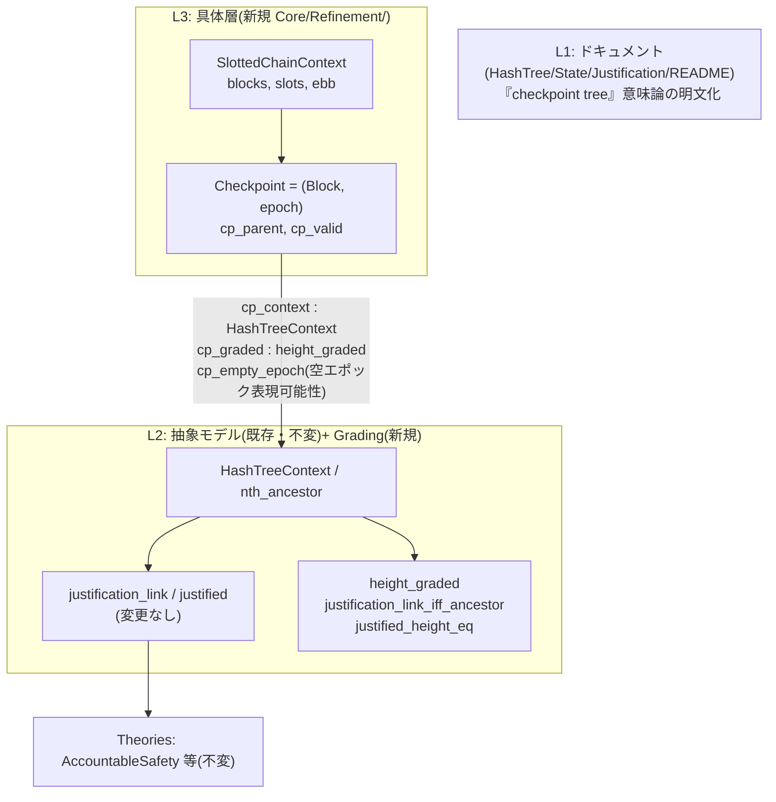
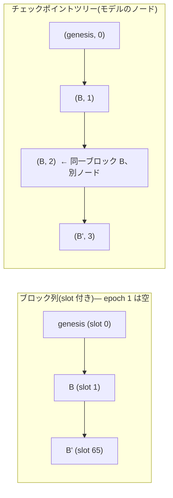

# Checkpoint Tree Remediation Plan

**対象リポジトリ**: gasper-lean4
**起案日**: 2026-08-14
**起点**: Ethereum 財団コンセンサス専門家によるレビュー指摘(justification の計算方法が Gasper の実際と一致しない疑い)
**ステータス**: 実施完了(2026-09-09、§10 実施記録を参照)

---

## 0. エグゼクティブサマリ

レビュアーの指摘は、コードの読解としては **完全に正確**である。`justification_link`
(`Core/AtomicDef/Justification.lean:225-238`)は source と target が **ちょうど
`t_h - s_h` 本の parent エッジ**で隔てられることを要求しており、`Hash` をブロックルート、
高さをエポックと読むと Gasper の定義(checkpoint = (block, epoch) の pair、ブロック間距離は
エポック差と無関係、空エポックでは同一ブロックが連続チェックポイントになり得る)と一致しない。
さらにこの読みでは `HashTreeContext` の irreflexivity により、空エポックをまたぐ合法な
justification が**表現不能**になる。

一方、移植元の Coq(`HashTree.v`)は「*We consider the checkpoint tree of blocks, and so a
'block' refers to a 'checkpoint block' throughout*」と明示しており、**ノード = チェックポイント
(epoch boundary pair)、parent = チェックポイントツリーの辺、高さ = attestation epoch = 木の深さ**
という解釈の下では本定義は健全な標準的抽象化である。Lean 移植はこの決定的な注記を落とし、
逆に「block tree / block identifiers」と記述してしまった。

本計画は、**既存の定義・定理・証明を一切変更せず**、次の三層で問題を解消する:

| 層 | 内容 | 成果物 |
|---|---|---|
| L1 人間向け | 意味論ドキュメントの全面修正(Coq 注記の復元と強化) | docstring / README 改訂 |
| L2 抽象モデル内 | 「graded な木では距離条件は祖先条件と同値」「justification チェーン上の高さは真の深さに強制される」の機械証明 | `Grading.lean`(新規) |
| L3 具体層 | (block, epoch) pair からなるチェックポイントツリーを構成し、抽象モデルへの refinement と空エポックの表現可能性を機械証明 | `Refinement/`(新規)+ 実行可能 UseCase |

L1+L2 だけで信頼に足る回答になり、L3 まで完遂すればレビュアーの疑義への完全な反証となる。

---

## 1. 背景 — 確定した事実

評価フェーズ(本計画の前段)で以下を一次資料と突き合わせて確認済み。

1. **コードの現状**: `justification_link` は
   `s_h < t_h ∧ nth_ancestor parent (t_h - s_h) s t ∧ supermajority_link …`
   (`Core/AtomicDef/Justification.lean:236-238`)。`nth_ancestor` は「ちょうど n 本の
   parent エッジ」の graded 関係(`Core/AtomicDef/HashTree.lean:205-212`)。
2. **Coq 原典との一致**: RV `Justification.v` の `justification_link` と一字一句同型。
   忠実な移植であり、Lean 側で定義を「発明」したのではない。
3. **Coq 原典の意味論注記**: `HashTree.v` 冒頭に checkpoint tree 注記あり。
   **Lean 版はこれを落とし**、`HashTree.lean:8-9` は「**block tree** … A type H of block
   identifiers」、`State.lean:74` は「the source **block** identifier」と記述。
   リポジトリ全体を grep しても「checkpoint tree」という語は一度も現れない。
4. **Gasper 論文(arXiv:2003.03052)の定義**:
   - Section 4: 「*a block may appear more than once as a checkpoint on the same chain*」
     (空エポックの例として (B, 2), (B, 3) を明示)。
   - Def 4.5 / 4.6: supermajority link と justification は pair 間の関係で、ブロック間の
     block-tree 距離への制約は**課さない**(素の J(G) には祖先条件すらない)。
   - Def 4.9: k-finalization は「adjacent epoch boundary pairs in chain(B_k)」。
   - Section 4.1: すべてのブロック B について EBB(B, 0) = B_genesis。
5. **チェックポイントツリーは epoch で graded**: pair (B, j) (j ≥ 1) の親は
   (EBB(B, j−1), j−1) として chain(B) から一意に定まり、EBB(B,0) = genesis なので
   pair (B, j) の深さはちょうど j。従って「source pair が target pair の祖先」⟺
   「`nth_ancestor (t_h − s_h)`」が成り立つ。**この同値が本モデルの正当化の核心**だが、
   現状どこにも(文書としても定理としても)存在しない。

## 2. 方針決定 — 検討した選択肢と採否(自己批判)

### 案A: コア定義の書き換え(棄却)

`justification_link` の graded 条件を `hash_ancestor`(距離なし祖先)+ 高さ整合に置換する案。

- **棄却理由**: AccountableSafety の surround-vote ケース解析
  (`k_slash_surround_case_general` 等)と `StrongInductionLtn`(高さギャップ上の強帰納法)は
  高さ算術と `nth_ancestor` の grading に本質的に依存しており、全証明木の改修になる。
  graded 解釈の下では新旧定義は同値(→ L2 でそれ自体を定理化する)なので、
  **意味論上の利得ゼロに対しバグ誘発リスクが最大**。Coq との対応(README が掲げる
  provenance)も失う。本計画の最重要原則「別のバグを誘発しない」に真っ向から反する。

### 案B: ドキュメント修正のみ(単独では棄却)

- **棄却理由**: 「正しく解釈すれば正しい」という主張が機械検証されず、形式検証
  プロジェクトとしての説得力を欠く。特にレビュアー指摘から派生する最強の疑義
  「空エポック(同一ブロックの連続チェックポイント)が表現できないのでは」に対し、
  文章でしか答えられない。

### 案C: 定義不変・加算的に「解釈の正しさ自体を定理にする」(採用)

既存の定義を一切動かさず、(L1) 意味論の明文化、(L2) 抽象モデル内での同値定理、
(L3) 具体チェックポイント層と refinement、を積み増す。

- 既存 def / theorem に差分ゼロ → **既存証明の破壊が構造的に不可能**。
- レビュアーへの回答が「文章」ではなく「定理名」で示せる。
- 段階的に出荷可能(L1+L2 → L3)。

### 上流の問いへの自己批判

「そもそもチェックポイントツリー解釈にコミットすべきか、主張を『Casper FFG 抽象の形式化』に
格下げすべきか」も検討した。リポジトリ名・README が Gasper を掲げる以上、主張を下げるのではなく
**refinement で主張を裏付ける**のが誠実である。ただし L3 が難航した場合に備え、README の限界節
(§7)で「形式化済み / 未形式化」の境界を先に明示する構成とし、L3 は主張の**強化**であって
前提ではない形にする。

---

## 3. 修正の全体像



空エポックのケースが両解釈でどう見えるか(ドキュメントと UseCase で使う説明図):



**大局と局所の分担**: §2–3 が大局(妥当性主張の構造)、§4 以降が局所(補題ステートメント、
Nat 減算の罠、Verso 参照、公理監査などの具体的落とし穴)を扱う。

---

## 4. フェーズ別詳細

### Phase 0 — 準備(0.5 人日)

- ブランチ `fix/checkpoint-tree-semantics` を作成。
- **用語棚卸し**: `grep -rn "block" GasperBeaconChain --include="*.lean"` の docstring 出現を
  全件レビューし、「ブロック → チェックポイント」に読み替えるべき箇所のインベントリを作る
  (Visualizations の表示文言も対象。少なくとも `HashTree.lean`, `State.lean`,
  `Justification.lean`, `Quorums.lean:94`, `Lemmas/HashTree.lean` 冒頭、
  `Executable/` の各 doc を含む)。
- **数学的下書き**: §4.3 の `ebb_tower` 補題の紙上証明を先に完成させる
  (最高リスク項目を最初に潰す。Lean で詰まってからの手戻りを防ぐ)。

**完了条件**: インベントリ表と `ebb_tower` の紙上証明が本ファイルの付録として追記されている。

### Phase 1 — 意味論ドキュメントの修正(1 人日)

**原則**: 識別子(`Hash`, `parent`, `Vote` のフィールド名等)は**リネームしない**
(Coq 対応と API 安定性を維持)。変更はプローズ(docstring / README)のみ。

| ファイル | 修正内容 |
|---|---|
| `Core/AtomicDef/HashTree.lean` | モジュール doc と `HashTreeContext` doc を「checkpoint tree」に改める。Coq 原典の注記を引用の形で復元し、拡張: ノード = Gasper の epoch boundary pair (B, j)。**同一ブロックルートが複数ノードとして現れ得る**。parent = 1 attestation epoch 分のチェックポイントツリーの辺であり、スロットレベルのブロック親関係では**ない**。irreflexivity はチェックポイントノードの性質であり、同一ルートの pair 反復と矛盾しないことを明記 |
| `Core/AtomicDef/State.lean` | `Vote` doc: source/target は**チェックポイント識別子**。高さ = attestation epoch(= 深さ)。eth2 の `Checkpoint = (epoch, root)` との対応と、高さフィールドの冗長性を明記。モデルは高さ不整合な票も許容する(敵対者の票集合のスーパーセットであり、安全性定理を弱めない)ことを明記 |
| `Core/AtomicDef/Justification.lean` | `justification_link` doc: graded 条件は grading の下で「source checkpoint が target の checkpoint chain 上にある」と同値であることを述べ、Phase 2 の `justification_link_iff_ancestor` を `{name}` 参照。Gasper Def 4.6 の素の J(G) には祖先条件がないこと、本モデルはチェーンごとの計算(valid vote)に対応する意図的な強化であることを明記 |
| `README.md` | §Phase 5 でまとめて改訂(先行して TODO マーカーのみ) |
| その他インベントリ該当箇所 | 「block」→「checkpoint (block)」への文言調整 |

**リスクと対策**:
- Verso の `{name}`/`{lit}` 参照切れ → 新規宣言への `{name}` 参照は **Phase 2 実装後に付け替え**
  (それまでは `{lit}`)。`make verso-facet` でビルド検証。
- docstring 変更は証明に影響しないが、**差分レビューで「意図せず定義本体に触れていない」ことを
  git diff の hunk 単位で確認**する。

**完了条件**: `lake build` 通過、Verso ビルド通過、インベントリ全件消化。

### Phase 2 — 抽象 grading 理論(1 人日)

**新規ファイル**: `Core/AtomicDef/Grading.lean`(定義)、`Core/Lemmas/Grading.lean`(補題)。
既存ファイルへの変更は `Core/All.lean` 系への import 追記のみ。

```lean
/-- 高さ関数 ht が (parent, genesis) 上の grading であること:
    genesis の高さ 0、parent 一歩ごとに高さがちょうど 1 増える。 -/
def height_graded (parent : HashParent Hash) (genesis : Hash)
    (ht : Hash → Nat) : Prop :=
  ht genesis = 0 ∧ ∀ {h₁ h₂ : Hash}, parent h₁ h₂ → ht h₂ = ht h₁ + 1
```

追加する補題(ステートメントを先に固定し、実装時の迷いを排除する):

```lean
-- (G1) 祖先方向の単調性
theorem height_le_of_ancestor :
  height_graded parent genesis ht → hash_ancestor parent s t → ht s ≤ ht t

-- (G2) 距離の一意性: graded な木では nth_ancestor の n は高さ差に強制される
theorem height_eq_of_nth_ancestor :
  height_graded parent genesis ht → nth_ancestor parent n s t → ht t = ht s + n

-- (G3) 素の祖先関係から graded 祖先関係へ(G1 を用いて Nat 減算を正当化)
theorem nth_ancestor_of_ancestor :
  height_graded parent genesis ht → hash_ancestor parent s t →
  nth_ancestor parent (ht t - ht s) s t

-- (G4) 本丸: 高さが真の深さであるとき、justification_link の graded 条件は
--      「単なる祖先条件」と同値 — レビュアーへの回答の中心となる定理
theorem justification_link_iff_ancestor :
  height_graded parent genesis ht →
  (justification_link τ stake vset parent st s t (ht s) (ht t) ↔
     ht s < ht t ∧ hash_ancestor parent s t ∧
     supermajority_link τ stake vset st s t (ht s) (ht t))

-- (G5) 高さの強制: 票の高さフィールドは敵対者が自由に選べるが、
--      justification チェーン上では真の深さに一致することが強制される
theorem justified_height_eq :
  height_graded parent genesis ht →
  justified τ stake vset parent genesis st b h → h = ht b
```

**証明方針**: G1–G3 は `hash_ancestor` / `nth_ancestor` の帰納法(G3 のステップで
`(ht h₂ + 1) − ht s = (ht h₂ − ht s) + 1` に G1 の `ht s ≤ ht h₂` を使う)。
G4 は G2/G3 と既存の `nth_ancestor_ancestor`(`Lemmas/HashTree.lean:237`)の合成。
G5 は `justified` の帰納法: genesis 節は grading の第 1 成分、link 節は帰納法の仮定
`s_h = ht s` と G2 から `ht t = ht s + (t_h − s_h) = t_h`(`s_h < t_h` ガード下で
`Nat.sub_add_cancel` 系、既存 `NatExt.lean` を再利用)。

**リスクと対策**: Nat の切り捨て減算 → すべての減算を `≤` / `<` ガード下に置く
(ステートメント段階で保証済み)。Mathlib 補題経由の `Classical.choice` 混入 →
帰納法直書きを基本とし、`make audit` をゲートにする。

**完了条件**: G1–G5 が `sorry` なしで証明され、`make audit` で公理集合が
`Quot.sound` / `propext` のみであること。

### Phase 3 — 具体チェックポイント層と refinement(2–3 人日)

**新規ディレクトリ**: `Core/Refinement/` — `SlottedChain.lean`, `CheckpointTree.lean`。
既存ファイルへの変更は import 追記のみ。

#### 3a. SlottedChain — slot 付きブロック構造(Gasper §4.1 の最小モデル)

```lean
structure SlottedChainContext (Block : Type u) where
  bparent : Block → Option Block      -- 子 ↦ 親(関数なので at-most-one は自動)
  slot    : Block → Nat
  bgenesis : Block
  C : Nat                             -- slots per epoch(Gasper の C)
  hC : 0 < C
  slot_genesis : slot bgenesis = 0
  bparent_genesis : bparent bgenesis = none
  slot_lt : ∀ {b p}, bparent b = some p → slot p < slot b
  reaches_genesis : ∀ b, breachable bparent bgenesis b
```

(`breachable` は bparent ステップの反射推移閉包。フィールド構成は実装時に
「証明に実際に使った仮定だけ残す」方針で最小化を再検討する。)

**EBB(Gasper Def: epoch boundary block)— 計算可能な定義**:

```lean
/-- chain(b) 上で slot ≤ j·C を満たす最新ブロック。停止性は slot の減少による。 -/
def ebb (ctx : SlottedChainContext Block) (b : Block) (j : Nat) : Block :=
  if ctx.slot b ≤ j * ctx.C then b
  else match ctx.bparent b with
       | some p => ebb ctx p j
       | none   => b        -- reaches_genesis の下では到達不能な枝
```

主要補題:

```lean
theorem ebb_slot_le  : slot (ebb ctx b j) ≤ j * C          -- reaches_genesis を使用
theorem ebb_self_iff : ebb ctx b j = b ↔ slot b ≤ j * C
theorem ebb_zero     : ebb ctx b 0 = bgenesis              -- EBB(B,0) = genesis(論文 §4.1)
-- ★ 最重要(タワー補題): EBB は入れ子に対して整合する
theorem ebb_tower (h : j₁ ≤ j₂) : ebb ctx (ebb ctx b j₂) j₁ = ebb ctx b j₁
```

`ebb_tower` の証明骨子(Phase 0 で紙上証明を先行させる対象):
`ebb b j₂` の再帰構造に関する帰納法。`slot b ≤ j₂·C` の場合は左辺 = `ebb b j₁` で自明。
`slot b > j₂·C` の場合、`j₁ ≤ j₂` より `slot b > j₁·C` でもあるので両辺とも
`bparent b` に降りて帰納法の仮定に帰着。functional induction が使えない場合は
`slot b` に関する強帰納法に切り替える(fallback を予め決めておく)。

#### 3b. CheckpointTree — pair からなる木と抽象モデルへの接続

```lean
structure Checkpoint (Block : Type u) where
  block : Block
  epoch : Nat
deriving DecidableEq

/-- (B, j) が自己整合なチェックポイントであること(B が epoch j の EBB たり得る)。 -/
def cp_valid (ctx) (c : Checkpoint Block) : Prop := ctx.slot c.block ≤ c.epoch * ctx.C

/-- チェックポイントツリーの親: (B, j+1) の親は (ebb B j, j)。子から一意に定まる。 -/
def cp_parent (ctx) : HashParent (Checkpoint Block) := fun c₁ c₂ =>
  c₂.epoch = c₁.epoch + 1 ∧ c₁.block = ebb ctx c₂.block c₁.epoch

def cp_genesis : Checkpoint Block := ⟨ctx.bgenesis, 0⟩
```

**設計判断(明記して後で疑えるように)**: `cp_valid` はサブタイプではなく述語とする。
サブタイプにすると `HashTreeContext` インスタンスや `DecidableEq` に強制(coercion)の
複雑さが波及する。invalid な pair もノードとして存在するが、grading・深さ定理に
`cp_valid` 仮定を付ければ足り、`HashTreeContext` の法則(irreflexivity /
at-most-one-parent)は validity なしで成立する。

証明する定理:

```lean
-- (R1) 抽象モデルの木構造の実現(irreflexive: epoch が異なるので自明 /
--      at-most-one: 親は子の関数なので自明)
def cp_context (ctx) : HashTreeContext (Checkpoint Block)

-- (R2) epoch は grading — これで Phase 2 の G1–G5 がすべて具体層に降りてくる
theorem cp_graded : height_graded (cp_parent ctx) cp_genesis (fun c => c.epoch)

-- (R3) ★ 空エポックの表現可能性(レビュアーの核心的疑義への機械的反証):
--      任意の valid チェックポイントは、同一ブロックのまま次エポックの
--      チェックポイントの親になれる
theorem cp_empty_epoch (h : cp_valid ctx c) :
  cp_parent ctx c ⟨c.block, c.epoch + 1⟩

-- (R4) 深さ = epoch: valid な (B, j) は genesis からちょうど j ステップ
theorem cp_depth (h : cp_valid ctx ⟨B, j⟩) :
  nth_ancestor (cp_parent ctx) j cp_genesis ⟨B, j⟩

-- (R5) ★ 対応定理: 抽象モデルの祖先条件 ⟺ Gasper の
--      「source checkpoint が target の checkpoint chain 上にある」
theorem cp_link_correspondence
    (h₁ : cp_valid ctx c₁) (h₂ : cp_valid ctx c₂) (hle : c₁.epoch ≤ c₂.epoch) :
  hash_ancestor (cp_parent ctx) c₁ c₂ ↔ c₁.block = ebb ctx c₂.block c₁.epoch
```

R5 の → 方向は cp_parent の定義と `ebb_tower` の反復、← 方向は `c₂.epoch − c₁.epoch` に
関する帰納法で親を一段ずつ構成(各段の validity は `ebb_slot_le` から)。
R2 + Phase 2 の G4 を合成すると、**「具体チェックポイントツリー上では、
`justification_link` の graded 条件は『source が target のチェックポイントチェーン上に
ある』ことと同値」**という、レビュアーの指摘に対する完全な回答が定理として得られる。

**完了条件**: R1–R5 が `sorry` なしで証明され、公理監査を通過。

### Phase 4 — 実行可能 UseCase: EmptyEpoch(0.5–1 人日)

**新規ファイル**: `Executable/UseCases/EmptyEpoch.lean`(`Finality.lean` のパターンを踏襲)。

- 小さな有限モデル(例: `Block := Fin 3`、slots `0, 1, 2C+1`、`C := 2`、`V := Fin 99`)上で
  チェックポイント `(b₁, 1)` と `(b₁, 2)` を **同一ブロック・別ノード**として構成し、
  supermajority link `(b₁,1) → (b₁,2)` により `(b₁, 2)` が `justified` になることを
  `decide` で証明し `#eval` で確認する。
- これは「空エポックをまたぐ justification はこのモデルで表現できないのでは」という
  読みに対する、**実行して確かめられる反例**になる。
- `Checkpoint` に有限 `Fintype` インスタンスを与えるため、UseCase 内では epoch を
  `Fin E` に有界化した具体型(または `Fin nB × Fin nE` との同型経由)を使う。

**リスクと対策**: `decide` の計算量 → 既存 UseCase(V = 99, H = 6)と同規模以下に抑え、
`#eval` で先に計測してから `decide` 化する。

**完了条件**: `lake build` で `#eval` / `decide` がタイムアウトなく通る。

### Phase 5 — README 改訂とレビュアー返信(0.5 人日)

README に新節 **「Model interpretation: the checkpoint tree」** を追加:

1. 3 行サマリ(木のノードはチェックポイント。Coq 原典注記の復元であること)。
2. **対応表**(各行に「形式化済み / 文書のみ」列を付け、過剰主張を構造的に防ぐ):

| Gasper の概念 | モデルでの対応物 | 裏付け |
|---|---|---|
| epoch boundary pair (B, j) | `Hash` のノード(具体層では `Checkpoint`) | R1 |
| attestation epoch | 高さ `s_h`, `t_h`(= 木の深さ) | R2, G5 |
| 「source が target の checkpoint chain 上」 | `nth_ancestor (t_h − s_h) s t` | G4, R5 |
| 空エポック(同一ブロックの pair 反復) | 同一 `block` を持つ別ノード | R3, EmptyEpoch |

3. **Honest limitations 節**(誠実性の担保):
   - `justification_link` は Gasper Def 4.6 の素の J(G) より狭い(祖先条件を課す)。
     これはチェーンごとの justification 計算・valid vote に対応する意図的な強化である。
   - beacon state transition(committee 選出、`process_justification_and_finalization`)の
     full simulation は未形式化。refinement は checkpoint tree の構造的対応まで。
   - `Vote` の高さフィールドはチェックポイント識別子に対し冗長であり、不整合な票も
     許容される(敵対者スーパーセットとして安全性を弱めない。G5 が整合性の強制を示す)。

**レビュアー返信ドラフト(英語)**:

> Thank you — your reading of the Lean code is exactly right: `justification_link` does
> require the source and target to be separated by exactly `t_h − s_h` parent links.
> The intended semantics, inherited from the RV Coq development this repo ports
> (`HashTree.v`: "a 'block' refers to a 'checkpoint block' throughout"), is that the
> tree is Gasper's *checkpoint tree*: nodes are epoch boundary pairs (B, j) — so the
> same block root can occur as several distinct nodes across empty epochs — the parent
> edge spans one attestation epoch, and heights are attestation epochs, which coincide
> with tree depth. Under that reading the graded condition is equivalent to "the source
> checkpoint lies on the target's checkpoint chain," which is Gasper's condition.
> Our Lean port dropped that crucial note and even described the structure as a "block
> tree" — that is a real defect on our side, and your reading is the natural one for the
> code as documented. We are fixing this in three layers: (1) the interpretation is now
> documented throughout; (2) it is machine-checked in the abstract model
> (`justification_link_iff_ancestor`: with heights equal to true depths, the graded
> condition reduces to plain checkpoint ancestry; `justified_height_eq`: heights along
> justification chains are forced to be true depths); and (3) a concrete refinement
> layer builds the checkpoint tree from slotted blocks via EBB and proves the
> correspondence, including representability of empty epochs
> (`cp_empty_epoch`, plus an executable example). We also document the deliberate
> deviations from the paper's raw Definition 4.6 (our justification links require
> checkpoint ancestry, matching per-chain justification).

---

## 5. 非退行ガードレール(バグ誘発防止)

**不変条件(全フェーズ共通)**:

1. 既存の `def` / `theorem` / `instance` / `structure` の**名前・ステートメント・証明本体を
   一切変更しない**。許される既存ファイル差分は (a) docstring、(b) `All.lean` 系への
   import 追記、のみ。
2. 新規宣言はすべて新規ファイルに置く(名前空間衝突を `lake build` で検出可能にする)。
3. `sorry` / `admit` / 新規 `axiom` は一切導入しない。

**フェーズごとのゲート**(全通過を出荷条件とする):

```
lake build                 # 全証明の再検証(既存定理の非破壊を機械的に保証)
make audit                 # 公理監査: Quot.sound / propext 以外の混入を検出
make verso-facet (P1, P5)  # ドキュメント参照({name}/{lit})の整合性
git diff レビュー           # hunk 単位で「docstring と import 以外の既存差分ゼロ」を目視確認
CI (lean_action_ci / pages) # プッシュ後の二重確認
```

## 6. リスク登記簿

| # | リスク | 影響 | 対策 |
|---|---|---|---|
| 1 | `ebb_tower` の証明難航(functional induction の癖) | P3 遅延 | Phase 0 で紙上証明を先行。fallback として slot の強帰納法を予め設計 |
| 2 | Nat 切り捨て減算による偽の補題ステートメント | 静かな意味論バグ | 全減算を `≤`/`<` ガード下に置く(§4.2 でステートメント段階から保証)。`NatExt.lean` の既存補題を再利用 |
| 3 | Mathlib 経由の `Classical.choice` 混入 | README の構成性主張の毀損 | 帰納法直書きを基本、`make audit` をフェーズゲート化 |
| 4 | Verso `{name}` 参照切れ | doc ビルド失敗 | 新規宣言への参照は実装後に付け替え。`make verso-facet` で検証 |
| 5 | `decide` の計算爆発(P4) | UseCase が使い物にならない | モデルを既存 UseCase と同規模以下に設計、`#eval` で事前計測 |
| 6 | ドキュメントでの過剰主張(refinement の射程を超える主張) | 次のレビューで再指摘 | 対応表に「裏付け」列を必須化し、定理名で言えないことは limitations 節へ |
| 7 | 「checkpoint tree」への用語変更が Coq provenance の説明と齟齬 | 混乱 | 「Coq 原典注記の復元である」ことを各修正箇所に明記(原文引用つき) |
| 8 | `SlottedChainContext` の仮定が強すぎる/弱すぎる | モデルの信頼性 | 実装完了後に「各仮定がどの補題で使われたか」を棚卸しし、未使用仮定は削除、追加仮定は README に明記 |

## 7. スコープ外(明示)

- eth2 beacon state transition(committee、`process_justification_and_finalization`)の
  形式化。refinement は checkpoint tree の構造的対応まで。
- Gasper Def 4.6(祖先条件なしの素の J(G))を弱い側に合わせたモデル変種の検証。
  limitations として文書化するに留める(将来課題として issue 化)。
- 動的 validator set の意味論拡張(既存のまま)。
- 識別子リネーム(`Hash` → `CheckpointId` 等)。文書で解決する。

## 8. 受け入れ基準

- **AC1**: `HashTree.lean` / `State.lean` / `Justification.lean` / README に checkpoint tree
  解釈が明記され、単独の「block tree」表現が残っていない(意図的な対比説明を除く)。
- **AC2**: G4 `justification_link_iff_ancestor`・G5 `justified_height_eq` が `sorry` なしで
  証明され、公理監査を通過。
- **AC3**: R1 `cp_context`・R2 `cp_graded`・R3 `cp_empty_epoch`・R5 `cp_link_correspondence`
  が証明済み。
- **AC4**: EmptyEpoch UseCase が `decide` で通り、同一ブロックルートの連続チェックポイントの
  justification を実演する。
- **AC5**: 既存の全 `def`/`theorem` に差分ゼロ(docstring・import を除く)で `lake build` 通過。
- **AC6**: 新規部分を含む公理集合が `Quot.sound` / `propext` のみ。
- **AC7**: レビュアー返信の全主張が AC1–AC6 の成果物(定理名)で裏付けられる。

## 9. マイルストーン

| フェーズ | 内容 | 目安 | 出荷単位 |
|---|---|---|---|
| P0 | 準備・棚卸し・紙上証明 | 0.5 日 | — |
| P1 | 意味論ドキュメント修正 | 1 日 | ─┐ |
| P2 | 抽象 grading 理論(G1–G5) | 1 日 | ─┤ **最小の信頼できる回答**(P1+P2+P5) |
| P5' | README 限界節+返信送付 | 0.5 日 | ─┘ |
| P3 | 具体層 refinement(R1–R5) | 2–3 日 | ─┐ |
| P4 | EmptyEpoch UseCase | 0.5–1 日 | ─┤ **完全回答**(返信の追補) |
| P5 | README 対応表の完成 | (P5' に吸収) | ─┘ |

合計 5.5–7 人日。P1+P2+P5' を先に出荷し、レビュアーには「文書修正+抽象同値定理」で
一次回答、P3+P4 完了後に「refinement による完全な裏付け」を追補する二段構えとする。

---

## 付録 A(Phase 0 成果物)— 用語棚卸し

`grep -rn -i "block" GasperBeaconChain --include="*.lean"` の全 289 件を分類した。
方針: **識別子は一切リネームしない**(`blocks_exist_high_over`, `block1_justified` 等は対象外)。
プローズ中の「block」は、それが *チェックポイント木のノード* を指す箇所のみ
「checkpoint」に読み替え、Gasper 論文のスロット単位のブロックを指す箇所はそのまま残す。

| 区分 | ファイル | 該当 | 処置 |
|---|---|---|---|
| **A. 定義の意味論(最優先)** | `Core/AtomicDef/HashTree.lean` | モジュール doc「Block tree」「block identifiers」、`HashParent`/`hash_parent_irreflexive`/`hash_at_most_one_parent`/`HashTreeContext`/`hash_ancestor`/`nth_ancestor` の各 doc(計 21 件) | 全面改訂: checkpoint tree 意味論、Coq 原典注記の復元、空エポックとの整合を明記 |
| A | `Core/AtomicDef/State.lean` | `Vote` doc「source block identifier」「target block identifier」、projection doc「source block」「target block」(5 件) | checkpoint 識別子 + 高さ = attestation epoch の冗長性を明記 |
| A | `Core/AtomicDef/Justification.lean` | `justification_link` doc「tree ancestry」「checkpoint-height gap coincides with the tree distance」、`justified`/`finalized`/`k_finalized` doc「A block $`b`」(6 件) | graded 条件 ⟺ checkpoint chain 上の祖先条件(`justification_link_iff_ancestor`)を参照 |
| A | `Core/AtomicDef/Quorums.lean` | 「Each block $`b` is associated with a validator set」他(8 件) | 「checkpoint」に読み替え(vset はチェックポイントごと) |
| A | `Core/AtomicDef/PlausibleLiveness.lean` | `forward_link_votes` doc「in the block tree」(1 件) | 「checkpoint tree」に読み替え。§ Block existence(`blocks_exist_high_over`)は識別子由来のため据え置き、注記のみ追加 |
| **B. 補題層の説明文** | `Core/Lemmas/HashTree.lean` | モジュール doc、各補題見出し「Every block is its own ancestor」等(11 件) | 「block」→「checkpoint」(見出し含む) |
| B | `Core/Lemmas/Justification.lean` | 「block-tree relation」(88 行)、「depend only on the block tree」(140 行) | 「checkpoint-tree」に読み替え |
| B | `Core/Lemmas/AccountableSafety.lean:121` | 「in the block tree」 | 同上 |
| B | `Core/Lemmas/PlausibleLiveness.lean:129,811` | 「block-tree witness factory」「in the block tree」 | 同上 |
| B | `Core/Theories/AccountableSafety.lean:750` | 「no block-tree axioms」 | 同上 |
| B | `Core/Theories/PlausibleLiveness.lean:435` | 「in the block tree」 | 同上 |
| B | `Core/Theories/SlashableBound.lean:47` | 「no block tree」 | 同上 |
| **C. 一般語としての block(据え置き)** | `Lemmas/Weight.lean`, `Lemmas/SetTheoryProps.lean` | 「three-block decomposition」「additivity block」 | 集合分割の意味。対象外 |
| C | `Visualizations/Theme.lean:75` | CSS `display: block` | 対象外 |
| C | `Executable/UseCases/*.lean`, `Visualizations/KFinalization.lean` | `block1_justified` 等の識別子、`"finalizes block 1"` 等の具体例表示 | 識別子・具体例のため据え置き |
| **D. 設定・README** | `literate.toml:29` | `title = "HashTree: Block tree"` | 「HashTree: Checkpoint tree」 |
| D | `README.md:79` | 「block trees」 | 「checkpoint trees」+ 新節 |
| D | `GasperBeaconChain.lean` | 「block trees and ancestry」(Structure 節) | 「checkpoint trees」 |

## 付録 B(Phase 0 成果物)— `ebb_tower` の紙上証明

### 設定

`SlottedChainContext` の仮定(実装時に最小化した最終形):

* `bparent : Block → Option Block`, `slot : Block → Nat`, `bgenesis : Block`, `C : Nat`
* `slot_genesis : slot bgenesis = 0`
* `slot_lt : bparent b = some p → slot p < slot b`
* `root_unique : bparent b = none → b = bgenesis`

(計画 §4.3 の `hC : 0 < C`, `bparent_genesis`, `reaches_genesis` は、いずれの補題の証明にも
不要であることが判明したため **フィールドから削除**し、後二者は定理として導出する:
`bparent_genesis` は `slot_lt` + `slot_genesis` から、`reaches_genesis`(= `genesis_on_chain`)は
チェーン帰納法から得られる。)

`ebb` は燃料付き構造的再帰で定義する(well-founded 再帰は kernel で簡約されず `decide` が
使えないため。Phase 4 の実行可能性のための設計判断):

```
ebbAux j 0       b = b
ebbAux j (n+1)   b = if slot b ≤ j·C then b
                     else match bparent b with | some p => ebbAux j n p | none => b
ebb b j          = ebbAux j (slot b) b
```

### 補助命題

* **(P1) 燃料非依存性**: `slot b ≤ n` かつ `slot b ≤ m` ならば `ebbAux j n b = ebbAux j m b`。
  n に関する帰納法(b, m を一般化)。n = 0 なら slot b = 0 ≤ j·C で両辺 b。n+1 のとき、
  slot b ≤ j·C なら両辺 b。さもなくば bparent b = some p(none なら root_unique より
  b = genesis, slot b = 0 ≤ j·C で矛盾)。m = 0 は slot b ≤ 0 で同様に矛盾、m = m'+1 なら
  両辺とも p に降りて帰納法の仮定(slot p < slot b より slot p ≤ n, slot p ≤ m')。
* **(P2) 展開則**: `slot b ≤ j·C → ebb b j = b`;
  `¬ slot b ≤ j·C → bparent b = some p → ebb b j = ebb p j`(P1 で燃料を slot b + 1 に
  取り替えて一段展開し、再び P1 で slot p に戻す)。
* **(P3) チェーン帰納法**: `(∀ b, (∀ p, bparent b = some p → P p) → P b) → ∀ b, P b`。
  「slot b ≤ n → P b」を n の帰納法で示す(slot_lt で一段ごとに n が減る)。

### `ebb_tower` の証明

**主張**: `j₁ ≤ j₂ → ebb (ebb b j₂) j₁ = ebb b j₁`。

P3 により b に関するチェーン帰納法。

* **Case slot b ≤ j₂·C**: P2 より `ebb b j₂ = b`。左辺 = `ebb b j₁` = 右辺。
* **Case slot b > j₂·C**: `j₁ ≤ j₂` より `j₁·C ≤ j₂·C`、従って `slot b > j₁·C`。
  root_unique により bparent b = some p が存在(none なら b = genesis で slot b = 0 ≤ j₂·C、矛盾)。
  P2 を二回適用して `ebb b j₂ = ebb p j₂`, `ebb b j₁ = ebb p j₁`。
  左辺 = `ebb (ebb p j₂) j₁` = (帰納法の仮定 at p) `ebb p j₁` = 右辺。∎

### 系(R5 で使う形)

* `ebb_slot_le : slot (ebb b j) ≤ j·C`(同じチェーン帰納法。none 分岐は上と同様に到達不能)。
* `ebb_self_iff : ebb b j = b ↔ slot b ≤ j·C`(→ は ebb_slot_le、← は P2)。
* `ebb_zero : ebb b 0 = bgenesis`(slot (ebb b 0) ≤ 0 なので親を持てず、root_unique)。
* `ebb_idem : ebb (ebb b j) j = ebb b j`(tower の j₁ = j₂)。

---

## 10. 実施記録(2026-09-09)

### 成果物

| フェーズ | 成果物 | 状態 |
|---|---|---|
| P0 | 付録 A(用語棚卸し)、付録 B(`ebb_tower` 紙上証明) | 完了 |
| P1 | `HashTree.lean` / `State.lean` / `Justification.lean` / `Quorums.lean` / `PlausibleLiveness.lean`(AtomicDef)、`Lemmas/{HashTree,Justification,AccountableSafety,PlausibleLiveness}.lean`、`Theories/*.lean`、`GasperBeaconChain.lean`、`literate.toml` の docstring / 表題改訂 | 完了 |
| P2 | `Core/AtomicDef/Grading.lean`(`height_graded`)、`Core/Lemmas/Grading.lean`(G1 `height_le_of_ancestor`、G2 `height_eq_of_nth_ancestor`、G3 `nth_ancestor_of_ancestor`、G4 `justification_link_iff_ancestor`、G5 `justified_height_eq`、追加: `nth_ancestor_trans`、`justified_depth`) | 完了 |
| P3 | `Core/Refinement/SlottedChain.lean`(`SlottedChainContext`、`on_chain`、`chain_induction`、`ebb`、`ebb_slot_le`、`ebb_on_chain`、`on_chain_ebb_of_le`、`ebb_self_iff`、`ebb_zero`、`ebb_tower`、`ebb_idem`、`genesis_on_chain`、`bparent_genesis`)、`Core/Refinement/CheckpointTree.lean`(R1 `cp_context`、R2 `cp_graded`、R3 `cp_empty_epoch`、R4 `cp_depth`、R5 `cp_ancestor_iff_on_chain` / `cp_link_correspondence`、合成定理 `cp_justification_link_iff`、`cp_justified_height_eq`) | 完了 |
| P4 | `Executable/UseCases/EmptyEpoch.lean`(`#eval` 6 件 + `decide +kernel` 2 件 + 項レベル証明 `cp_12_justified` 等) | 完了 |
| P5 | README 新節「Model interpretation: the checkpoint tree」(対応表 + Honest limitations)、`planning/reviewer-reply.md`(返信ドラフト最終版) | 完了(返信の送付は人手) |

### 受け入れ基準の検証

| AC | 検証方法 | 結果 |
|---|---|---|
| AC1 | `grep -rn -i "block tree\|block-tree"` — 残存は意図的対比(`Justification.lean` / `Lemmas/Grading.lean` の "slot-level block tree"、README の "not the slot-level block tree")のみ | ✓ |
| AC2 | `lake build` 通過、`make audit` で G4 / G5 は propext・Quot.sound のみ | ✓ |
| AC3 | R1–R5 が `sorry` なしで証明済み(`CheckpointTree.lean`) | ✓ |
| AC4 | `#eval JE (1, 2) 2 = true`、`cp_12_justified_decide`(`decide +kernel`)、`cp_22_not_justified` | ✓ |
| AC5 | 既存 `.lean` の差分をコメント除去後に比較するスクリプトで検証: 全ファイル「docstring のみ」、`Core/All.lean` / `Executable/UseCases/All.lean` は import 追記のみ | ✓ |
| AC6 | `make audit`: 730 宣言、sorryAx / Classical.choice / native compute いずれも不使用、propext 528・Quot.sound 426(いずれも Finset / State 経由) | ✓ |
| AC7 | `planning/reviewer-reply.md` の各主張に定理名を付記 | ✓ |

### 計画からの逸脱(記録)

1. **`SlottedChainContext` の仮定を最小化**(§6 リスク 8 の方針どおり): `hC : 0 < C`、
   `bparent_genesis`、`reaches_genesis` はどの補題にも不要だったため削除。後二者は定理として導出
   (`bparent_genesis`、`genesis_on_chain`)。残った仮定は `slot_genesis`、`slot_lt`、`root_unique`。
2. **`ebb` を燃料付き構造的再帰で定義**(付録 B): well-founded 再帰は kernel で簡約されず
   `decide` が使えないため。正しさは `ebbAux_fuel_irrel` で燃料非依存性を示してから
   展開則(`ebb_of_le` / `ebb_of_gt`)とチェーン帰納法(`chain_induction`)のみで証明。
3. **R5 の定式化**: 主定理は `cp_ancestor_iff_on_chain`(右辺を `on_checkpoint_chain` にまとめ、
   `epoch` 上界を右辺に吸収)。計画どおりの形(`hle` を仮定に持つ)は `cp_link_correspondence` として
   併置。→ 方向は `cp_valid c₁` のみ、← 方向は `cp_valid c₂` のみを使う(各方向を別補題として公開)。
4. **追加定理**: `justified_depth`(grading 仮定なしで「justified な (b, h) は genesis から
   ちょうど h 歩」)。G5 はこれと G2 の合成として証明。`on_chain_ebb_of_le`(`ebb` が
   「slot ≤ jC を満たす chain(B) 上の最新ブロック」であることの最大性)。
5. **UseCase の `decide`**: 12 ノード × 高さ 2 の `justifiedB` は既定の `decide`(Meta 簡約)では
   `maxRecDepth` / heartbeat 上限に達するため `decide +kernel` を使用(kernel 簡約のみ、
   追加公理なし — 監査で確認)。項レベルの証明(`cp_12_justified` 等)は `Checkpoint (Fin 3)` 上で
   `cp_parent` を直接用いており、有限エンコーディング `CP = Fin 3 × Fin 4` は `#eval` / `decide` 用。
6. **`{name}` 参照**: 新規宣言は既存ファイルより下流にあるため、既存ファイルからの参照は `{lit}`
   (Verso の解決対象外)。新規ファイル内では上流宣言に `{name}` を使用。

### 未実施(スコープ外、§7 のとおり)

- レビュアーへの返信送付(ドラフトは `planning/reviewer-reply.md`)。
- リモートへの push と CI 確認(ローカルで `lake build` / `make audit` / Verso ビルドを通過)。
